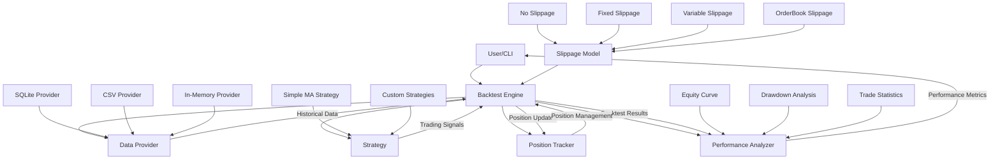

# Backtesting Framework Architecture

## Component Descriptions

### Backtest Engine
The core component that orchestrates the backtesting process. It loads historical data, processes it chronologically, feeds it to the strategy, executes signals, tracks positions, and calculates performance metrics.

### Data Provider
Responsible for retrieving and preparing historical market data for backtesting. Multiple implementations are available for different data sources.

### Strategy
Implements the trading logic that generates buy and sell signals based on market data. Strategies implement a common interface to work with the backtesting engine.

### Position Tracker
Manages positions during the backtest, including opening, updating, and closing positions. It tracks open positions, calculates P&L, and maintains a history of closed positions.

### Performance Analyzer
Calculates performance metrics and generates reports based on backtest results. It provides insights into strategy performance, including risk-adjusted returns, drawdowns, and trade statistics.

### Slippage Model
Simulates the price slippage that occurs in real trading. Different models are available to simulate various market conditions and order execution scenarios.
