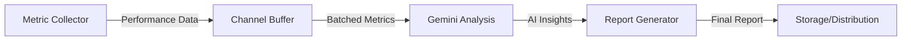

# Performance Reporting System with Go and Gemini Flash 2.0

## Overview
This document outlines the implementation of a periodic performance reporting system built with Go and powered by Google's Gemini Flash 2.0 AI. The system automatically collects performance metrics, analyzes them using AI, and generates comprehensive reports at configured intervals.

## Table of Contents
- [Architecture](#architecture)
- [Components](#components)
- [Implementation](#implementation)
- [Configuration](#configuration)
- [Deployment](#deployment)
- [Best Practices](#best-practices)

## Architecture

### System Design
The system is built on four main components:
1. Metric Collection
2. AI Analysis (Gemini Flash 2.0)
3. Report Generation
4. Storage/Distribution

### Data Flow


## Components

### Core System Types
```go
// main.go
package main

import (
    "context"
    "time"
    "sync"
    "encoding/json"
    "os"
)

type PerformanceMetrics struct {
    Timestamp   time.Time       `json:"timestamp"`
    Metrics     map[string]any  `json:"metrics"`
    SystemState SystemState     `json:"system_state"`
}

type SystemState struct {
    CPUUsage    float64 `json:"cpu_usage"`
    MemoryUsage float64 `json:"memory_usage"`
    Latency     int64   `json:"latency_ms"`
    // Add other relevant metrics
}

type ReportGenerator struct {
    metrics     chan PerformanceMetrics
    geminiAPI   *GeminiClient
    interval    time.Duration
    mu          sync.Mutex
}
```

### Gemini API Integration
```go
// gemini.go
type GeminiClient struct {
    apiKey     string
    endpoint   string
    httpClient *http.Client
}

func NewGeminiClient(apiKey string) *GeminiClient {
    return &GeminiClient{
        apiKey:     apiKey,
        endpoint:   "https://generativelanguage.googleapis.com/v1beta/models/gemini-2.0-flash:generateContent",
        httpClient: &http.Client{Timeout: 30 * time.Second},
    }
}

func (g *GeminiClient) AnalyzeMetrics(ctx context.Context, metrics PerformanceMetrics) (string, error) {
    payload := map[string]interface{}{
        "contents": []map[string]interface{}{
            {
                "parts": []map[string]interface{}{
                    {
                        "text": fmt.Sprintf("Analyze these performance metrics and provide key insights:\n%+v", metrics),
                    },
                },
            },
        },
    }
    // Implementation details for API call
}
```

### Metric Collection
```go
// collector.go
func (r *ReportGenerator) StartCollection(ctx context.Context) {
    ticker := time.NewTicker(r.interval)
    defer ticker.Stop()

    for {
        select {
        case <-ctx.Done():
            return
        case <-ticker.C:
            metrics := collectCurrentMetrics()
            r.metrics <- metrics
        }
    }
}

func (r *ReportGenerator) ProcessMetrics(ctx context.Context) {
    for metrics := range r.metrics {
        analysis, err := r.geminiAPI.AnalyzeMetrics(ctx, metrics)
        if err != nil {
            log.Printf("Error analyzing metrics: %v", err)
            continue
        }
        r.generateReport(analysis, metrics)
    }
}
```

### Report Generation
```go
// report.go
type Report struct {
    GeneratedAt time.Time         `json:"generated_at"`
    Period     string            `json:"period"`
    Analysis   string            `json:"analysis"`
    Metrics    PerformanceMetrics `json:"metrics"`
    Insights   []string          `json:"insights"`
}

func (r *ReportGenerator) generateReport(analysis string, metrics PerformanceMetrics) error {
    report := Report{
        GeneratedAt: time.Now(),
        Period:     "hourly", // or as configured
        Analysis:   analysis,
        Metrics:    metrics,
    }
    
    // Save report to file/database
    return nil
}
```

### Application Entry Point
```go
// main.go
func main() {
    ctx := context.Background()
    
    generator := &ReportGenerator{
        metrics:   make(chan PerformanceMetrics, 100),
        geminiAPI: NewGeminiClient(os.Getenv("GEMINI_API_KEY")),
        interval:  15 * time.Minute,
    }

    // Start collection and processing
    go generator.StartCollection(ctx)
    go generator.ProcessMetrics(ctx)

    // Keep the application running
    select {}
}
```

## Configuration

### Environment Variables
```bash
GEMINI_API_KEY=your_api_key_here
REPORT_INTERVAL=15m
METRICS_BUFFER_SIZE=100
```

### System Requirements
- Go 1.22 or later
- Access to Google Cloud Platform (for Gemini API)
- Sufficient system resources for metric collection

## Deployment

### Prerequisites
1. Go environment setup
2. Google Cloud account with Gemini API access
3. API key configuration
4. Proper system permissions for metric collection

### Installation Steps
1. Clone the repository
2. Set up environment variables
3. Install dependencies:
   ```bash
   go mod tidy
   ```
4. Build the application:
   ```bash
   go build -o performance-reporter
   ```
5. Run the service:
   ```bash
   ./performance-reporter
   ```

## Best Practices

### Concurrency Management
- Use buffered channels for metric collection
- Implement proper context cancellation
- Handle goroutine lifecycle carefully

### Error Handling
```go
// Example error handling pattern
if err := someOperation(); err != nil {
    log.Printf("Operation failed: %v", err)
    // Implement retry logic if appropriate
    return fmt.Errorf("operation error: %w", err)
}
```

### Security Considerations
1. API Key Management
   - Use environment variables
   - Implement key rotation
   - Never commit keys to version control

2. Data Protection
   - Sanitize inputs
   - Validate metrics before processing
   - Implement access controls for reports

### Performance Optimization
1. Channel Buffer Sizing
   - Configure based on collection frequency
   - Monitor for channel blocking

2. Memory Management
   - Implement proper cleanup
   - Monitor heap usage
   - Use appropriate data structures

### Monitoring and Logging
1. System Metrics
   - CPU usage
   - Memory consumption
   - Goroutine count
   - Channel buffer utilization

2. Application Logs
   - Use structured logging
   - Implement log levels
   - Include correlation IDs

## Troubleshooting

### Common Issues
1. API Rate Limiting
   ```go
   // Implement exponential backoff
   func retryWithBackoff(operation func() error) error {
       backoff := time.Second
       maxRetries := 3
       
       for i := 0; i < maxRetries; i++ {
           err := operation()
           if err == nil {
               return nil
           }
           time.Sleep(backoff)
           backoff *= 2
       }
       return fmt.Errorf("max retries exceeded")
   }
   ```

2. Memory Leaks
   - Monitor goroutine count
   - Implement proper cleanup
   - Use pprof for profiling

### Debug Tools
1. Logging
2. Metrics visualization
3. pprof profiling
4. Trace analysis

## Future Enhancements
1. Multiple report formats (PDF, HTML, JSON)
2. Custom metric collection plugins
3. Advanced AI analysis patterns
4. Real-time monitoring dashboard
5. Alert integration

## Contributing
Please follow the standard Go code style and include tests for new features.

## License
[Insert License Information] 