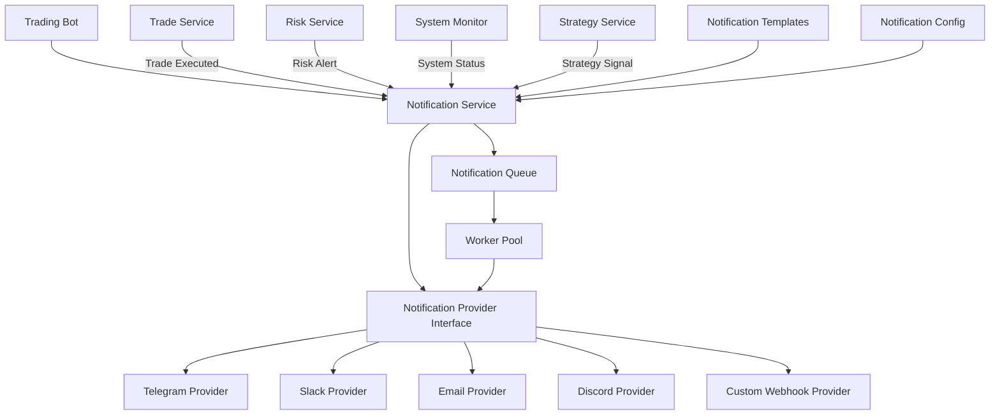

# Notification Service Architecture

The notification service provides a unified interface for sending notifications to various channels like Telegram and Slack. It allows the trading bot to send alerts, trade notifications, and system status updates to users.

## Architecture Overview



## Components

### Notification Service

The core service that provides a unified interface for sending notifications. It handles:
- Message formatting using templates
- Notification prioritization
- Rate limiting
- Delivery confirmation
- Retry logic

### Notification Provider Interface

An interface that all notification providers must implement:
```go
type NotificationProvider interface {
    // Initialize sets up the provider with configuration
    Initialize(config map[string]interface{}) error
    
    // Send sends a notification
    Send(notification *Notification) error
    
    // GetName returns the provider name
    GetName() string
    
    // IsAvailable checks if the provider is available
    IsAvailable() bool
}
```

### Notification Providers

#### Telegram Provider
Sends notifications to Telegram channels or direct messages using the Telegram Bot API.

#### Slack Provider
Sends notifications to Slack channels or direct messages using the Slack API.

#### Other Providers
The architecture supports additional providers like Email, Discord, and custom webhooks.

### Notification Queue

A queue that buffers notifications before sending them. This allows:
- Batching of notifications
- Prioritization based on importance
- Rate limiting to avoid API throttling
- Retry logic for failed deliveries

### Worker Pool

A pool of workers that process notifications from the queue and send them to the appropriate providers.

## Data Models

### Notification

```go
type NotificationLevel string

const (
    LevelInfo     NotificationLevel = "INFO"
    LevelWarning  NotificationLevel = "WARNING"
    LevelError    NotificationLevel = "ERROR"
    LevelCritical NotificationLevel = "CRITICAL"
    LevelTrade    NotificationLevel = "TRADE"
)

type Notification struct {
    ID          string            // Unique identifier
    Title       string            // Notification title
    Message     string            // Notification message
    Level       NotificationLevel // Notification level
    Source      string            // Source of the notification (e.g., "TradeService")
    Timestamp   time.Time         // When the notification was created
    Data        map[string]interface{} // Additional data for templating
    Attachments []Attachment      // Optional attachments (images, files)
    Providers   []string          // Specific providers to use (empty means all)
    Priority    int               // Priority (higher means more important)
}

type Attachment struct {
    Type        string // "image", "file", etc.
    URL         string // URL to the attachment
    ContentType string // MIME type
    Data        []byte // Raw data (optional)
}
```

### Notification Template

```go
type NotificationTemplate struct {
    ID          string            // Template identifier
    Title       string            // Template for title
    Message     string            // Template for message
    Level       NotificationLevel // Default level
    Providers   []string          // Default providers
    Priority    int               // Default priority
}
```

## Configuration

```yaml
notification:
  enabled: true
  default_providers: ["telegram", "slack"]
  queue:
    capacity: 1000
    workers: 5
  providers:
    telegram:
      enabled: true
      token: "your-telegram-bot-token"
      chat_ids:
        - "-1001234567890" # Group chat ID
        - "123456789" # User chat ID
      rate_limit: 20 # messages per minute
    slack:
      enabled: true
      token: "your-slack-token"
      channels:
        - "#trading-alerts"
        - "#system-status"
      rate_limit: 30 # messages per minute
  templates:
    trade_executed:
      title: "Trade Executed: {{ .Symbol }}"
      message: "{{ .Side }} {{ .Quantity }} {{ .Symbol }} at {{ .Price }}"
      level: "TRADE"
      providers: ["telegram", "slack"]
      priority: 10
    risk_alert:
      title: "Risk Alert: {{ .AlertType }}"
      message: "{{ .Message }}"
      level: "WARNING"
      providers: ["telegram", "slack"]
      priority: 20
    system_status:
      title: "System Status: {{ .Status }}"
      message: "{{ .Message }}"
      level: "INFO"
      providers: ["slack"]
      priority: 5
```

## Usage Examples

### Sending a Simple Notification

```go
notification := &Notification{
    Title:     "System Started",
    Message:   "Trading bot has started successfully",
    Level:     LevelInfo,
    Source:    "SystemService",
    Timestamp: time.Now(),
}

err := notificationService.Send(notification)
```

### Using a Template

```go
data := map[string]interface{}{
    "Symbol":   "BTCUSDT",
    "Side":     "BUY",
    "Quantity": 0.1,
    "Price":    50000.0,
}

err := notificationService.SendWithTemplate("trade_executed", data)
```

### Sending with Attachments

```go
attachment := Attachment{
    Type:        "image",
    ContentType: "image/png",
    Data:        chartImageBytes,
}

notification := &Notification{
    Title:       "Price Chart: BTCUSDT",
    Message:     "4-hour chart with moving averages",
    Level:       LevelInfo,
    Source:      "ChartService",
    Timestamp:   time.Now(),
    Attachments: []Attachment{attachment},
}

err := notificationService.Send(notification)
```
